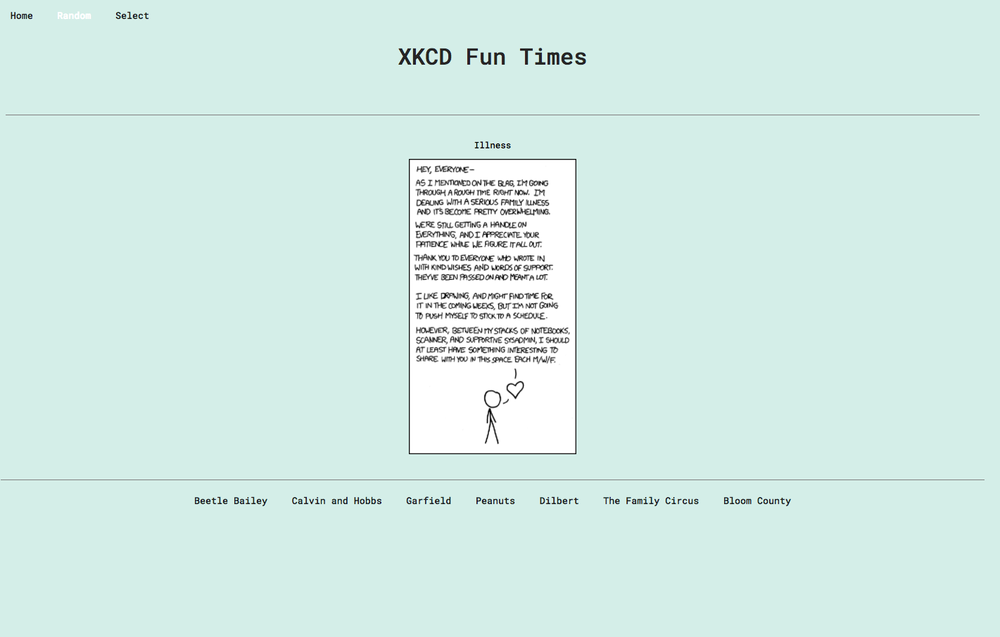

# Daily Comic
Michelle Bautista

## Objective
React Single Page Front-end API Project. I chose to use the XKCD comic strip api because I thought it would be a fun website for the times we need to laugh.

Homepage will bring up the daily or last comic that XKCD has posted.

Random will bring up a random comic.

Selected will bring up a comic 

## Links:
  Live URL: Coming soon still in mvp initial build process
  GitHubRepository: https://github.com/mba15/portfolio-projects/tree/master/daily-comic

## Technologies Used:
  * HTML, CSS, JavaScript, React
  * Node.js, 
  * Redux, Axios

## Screenshots
Home Page

 

Random Page

 

Select Page

 

## Future Additons
Phase 2
Add a database and a favorites page so people can save their favorites.
Login with google login auth.

